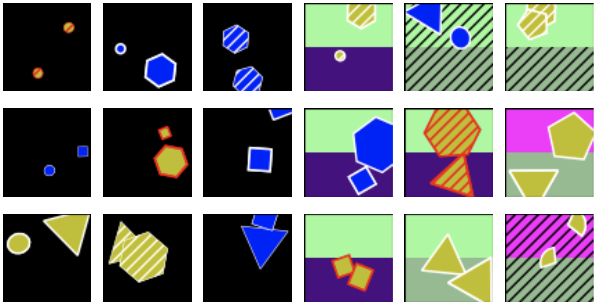

# ConceptShapes Datasets

ConceptShapes is a class of flexible synthetic datasets. Their key feature is that they have *concept labels* in addition to class labels. This way, the datasets can work to benchmark *concept-based models* (for example [concept bottleneck models (CBM)](https://proceedings.mlr.press/v119/koh20a.html)).

This repository contains all the code necessary to create the ConceptShapes datasets, but one can also download some common version here (link TBA). Creating a datasets takes about 10-20 minutes on an ordinary laptop.

The datasets consist of multiclass classification with images as input, and binary labels. The datasets are *flexible* in that the user can choose the amount of classes, concepts, corelation between concepts and classes, and more.

Various ConceptShapes datasets were used to benchmark hybrid concept-based models (link TBA).

## How to run the code

<!-- How to run the code, details in later section -->

<!-- files, where to save, constants, but maybe later -->

## Dataset details

<!-- More images, explain the concepts, how the datasets work, tables. -->