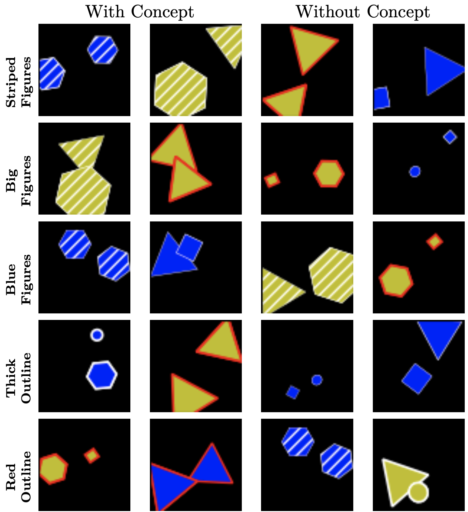
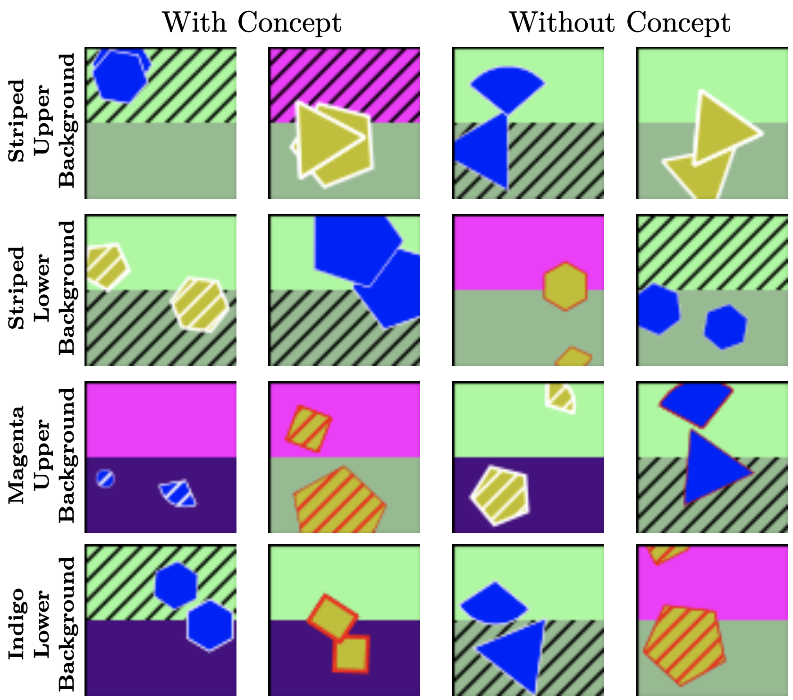
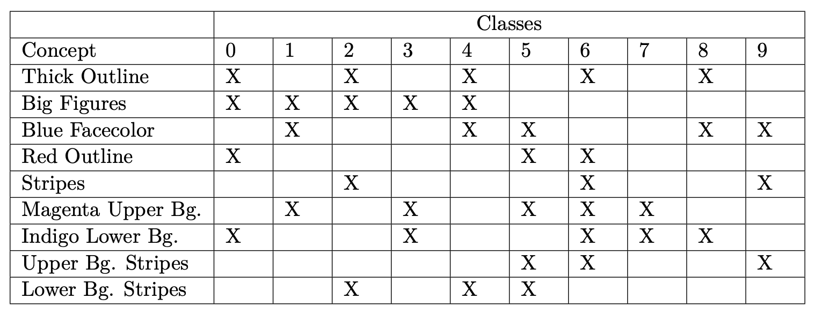
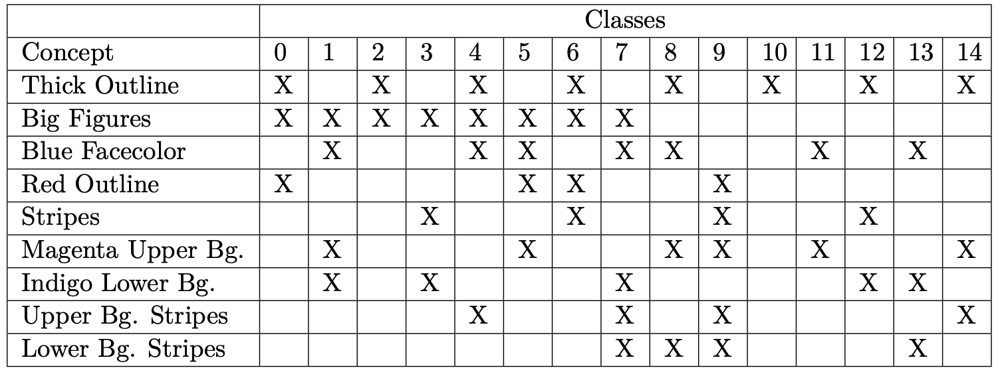
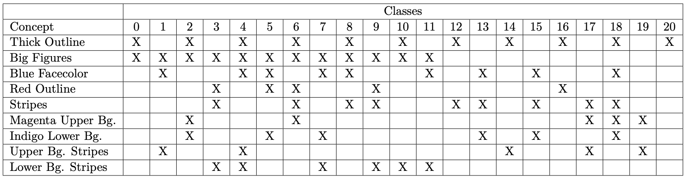

# ConceptShapes Datasets

ConceptShapes is a class of flexible synthetic concept datasets. Their key feature is that they have *concept labels* in addition to class labels. This way, the datasets can work to benchmark *concept-based models* (for instance [concept bottleneck models (CBM)](https://proceedings.mlr.press/v119/koh20a.html)).

This repository contains all the code necessary to generate ConceptShapes datasets, but one can also download some common versions from the releases (available soon). It also contains pytorch dataloaders and utility function to easily use the datasets. Creating a dataset takes about 5-20 minutes on an ordinary laptop, and are of sizes approximately 15MB-40MB.

The datasets consist of multiclass classification with images as input, and binary concept labels. The datasets are *flexible*, meaning that the user can choose the amount of classes, concepts, correlation between concepts and classes, and more.

Various ConceptShapes datasets were used to benchmark hybrid concept-based models.


*ConceptShapes example images. Left: 5-concepts, Right: 9 concepts.*

Here is a quick overview of the sections in this README:

- **Dependecies**: Information on how to install dependencies and create python or conda virtual environments.
- **Running Code and Creating Dataset**: How to actually create the datasets.
- **File and Dataset Structure**: Information about how the dataset is stored, along with how the datatables are orgianized.
- **Using the Datasets**: Information about how to use the utility functions, with example code to use the dataloaders.
- **ConceptShapes Overview**: Detailed information about the datasets.

## Dependencies

Creating the datasets only requires `numpy` and `matplotlib`. The dataloaders also use `torch` and `torchvision`.

Here are the specific versions of the libraries used:

- **Numpy:** 1.25.2
- **Matplotlib:** 3.5.3
- **Torch:** 2.0.1
- **Torchvision:** 0.15.2

and **Python** version 3.10.12.

### Installing Dependencies with Conda

- Run `conda env create -f environment.yaml` to create the conda environment.
- Run `conda activate conceptshapes_env` to activate the environment.

### Installing Dependencies with pip

- (Optional, but recommended) Create a virtual environment:
  - `python -m venv conceptshapes_venv`
  - Activate the environment:
    - On Windows: `conceptshapes_venv\Scripts\activate`
    - On macOS and Linux: `source conceptshapes_venv/bin/activate`
- Install the required packages: `pip install -r requirements.txt`

Note that `torch` and `torchvision` may take some time to install. If one does not intend to use the dataloaders, `torch` and `torchvision` can be commented out in the `requriements.txt` or `environment.yaml` file.

## Running Code and Creating Datasets

Simply run the file `make_conceptshapes_dataset.py` with command line arguments to create a ConceptShapes dataset. For example, if one wish to make a dataset with 15 classes, 9 concepts, and signal-strength (correlation between concepts and classes) 0.9, one can run:

```cli
python make_conceptshapes_dataset.py --n_classes 15 --n_concepts 9 --signal_strength 0.98
```

The default amount of images to create is 1000 per class. However, this can easily be changed with `--n_images_class <number>`.

The datatables can be aranged with subsets of the dataset, so one can easily assess model performance when the amount of datapoints varies. In order to make subsets of the data, one can use `--subsets_to_add <number1>,<number2>,...`. The default is subsets 50, 100, 150, 200 and 250 images from each class, when `n_images_class` is equal or larger than 500. For instance, if one would like subsets of 100, 200 and 300 instead, include `--subsets_to_add 100,200,300`. The full dataset will be split in train, validation and test tables, while the subsets will be split in train and validation, drawn from the full train and validation tables respectively. The test dataset will be the same for each subset.

The file `constants.py` contains variables naming the folders. If one wishes to change this, one should modify this file. All the paths are relative, so one does not have to change anything.

## File and Dataset Structure

The dataset filetree will look similar to this:

```filetree
data/
└── conceptshapes/
   └── shapes_1k_c10_a5_s100/
       ├── 0_triangle_triangle/
       ├── 1_triangle_rectangle/
       ├── 2_triangle_ellipse/
       ├── 3_triangle_hexagon/
       ├── 4_rectangle_rectangle/
       ├── 5_rectangle_ellipse/
       ├── 6_rectangle_hexagon/
       ├── 7_ellipse_ellipse/
       ├── 8_ellipse_hexagon/
       ├── 9_hexagon_hexagon/
       └── tables/
           ├── sub50/
           ├── sub100/
           ├── sub150/
           ├── sub200/
           ├── sub250/
           ├── test_data.pkl
           ├── train_data.pkl
           └── val_data.pkl
```

Where:

- `data/` is the root data folder (configurable from `constants.py`)
- `shapes_1k_c10_a5_s100/` is the name of a specific dataset (with 1k images per class, 10 classes, 5 concepts and signal strength 100%)
- The folders `0_triangle_triangle/`, ..., `9_hexagon_hexagon/` contains the images (saved as `.png`) for each respective class.
- The folder `tables/` contains information (such as labels and paths) for the dataset.
- The `sub50/`, `sub100/`, ... folders have tables corresponding to the subsets.

The datatables are lists of dictionaries, saved as pickle files. Each datapoint is a python dictionary with the following attributes:

- `img_path`: (PosixPath) Relative path to the images the datapoint is representing. For instance: `data/shapes/shapes_1k_c10_a5_s98/6_rectangle_hexagon/rectangle_hexagon_824.png`
- `class_label`: Integer class label, from 0 to `n_classes` - 1.
- `attribute_label`: (dict) Dictionary mapping concepts to binary concept labels. For instance, may contain the following key: value pairs:
  - `thick_outline`: 1
  - `big_figure`: 0
  - `dark_facecolor`: 0
  - `dark_outline`: 1
  - `stripes`: 0
- `class_name`: (str) The name of the class. For instance, a `class_label` of 0 might correspond to `class_name` of `triangle_triangle`.

The file `make_conceptshapes_datasets.py` is the one meant to be called (with various command line arguments) by the user to create a ConceptShapes dataset.

The file `conceptshapes_dataset.py` contains most of the code for actually creating the datasets, with some utility functions in `utils.py`.

To loader pytorch dataloaders of the data, use `load_data_conceptshapes()` from `conceptshapes_dataloaders.py` (for examples, see `Using the Datasets`).

Finally, `constants.py` contains some constants, particularly path names and possible figures for the images. One should use the path variables here if one wishes to change the folder names.

## Using the Datasets (Dataloaders and Utility Functions)

The file `conceptshapes_dataloaders.py` contains a class for a PyTorch dataloader and functions for using it. Simply call `load_data_conceptshapes(n_classes, n_concepts, signal_strength, n_subset)` to return pytorch dataloaders.

The dataloader class iterates over `(images, class_labels, concept_labels, paths)`. The paths are included to be able to conveniently plot and visualise, but will probably not be used in a normal training loop.

Here is a full example of using the dataloader:

```python
from conceptshapes_dataloaders import load_data_conceptshapes


train_loader, val_loader = load_data_conceptshapes(
    n_classes=10, n_attr=9, signal_strength=0.98, n_images_class=1000, n_subset=100, mode="train-val", batch_size=16)


for images, class_labels, concept_labels, paths in train_loader:
    print(f"Image shape: {images.shape}, Class labels shape: {class_labels.shape}. ")
    print(f"Concept labels shape: {concept_labels.shape}")
    break
```

Out:

```output
Image shape: torch.Size([16, 3, 64, 64]), Class labels shape: torch.Size([16]), Concept labels shape: torch.Size([16, 5])
```

Note that the provided dataloader iterates over four elements, instead of the fairly common two (data and labels). The training loop should therefore be altered slightly.

One might want to change the transforms, which can be done by simply altering or overwriting the function `get_transforms()`.
Please see the doc-string of `load_data_conceptshapes()` for more information about the keyword arguments.

In order to only load the datatables, one can run this:

```python
from utils import load_data_list

train_data_list = load_data_list(
    n_classes=15, n_attr=9, signal_strength=0.98, n_subset=None, n_images_class=1000, mode="train")
```

Set `n_subset` to for example `100` to use the 100 images per class subset. If it is set to `None`, the full data split will be returned.

### Renaming the Dataset and Paths

If one wishes to rename a dataset or path, one should use `change_dataset_name()` from `conceptshapes_datasets.py`. The tables contain paths to the images which are used by the dataloader, which the function changes for you. The argument should be a relative path from this folder to the dataset, for example `change_dataset_name("data/shapes/shape_1k_c10_a5_s98, "new_path")`.

### Changing Predefined Settings

If one wishes to change something that is predefined, like the resolution of images, classes not in [10, 15, 21] or concepts not in [5, 9], the code is pretty generic and easily adjustable. One can use the `generate_shapes_dataset()` from `conceptshapes_datasets.py`, which is more generic than the `make_specific_shapes_dataset()`. The code is well documented and should be decent to understand.

## ConceptShapes Overview

We now explain some details of how the ConceptShapes datasets look and work.

The target downstream task is to predict which two figures are present in each image. The datasets have either 4, 5 or 6 different figures, resulting in 10, 15 or 21 distinct classes (unordered draw without repetition).

A dataset can have either 5 or 9 concepts. All of the concepts are binary, being either present or not. The concepts are visually present, and are made to correlate with the classes (explained shortly). The datasets with 5 concepts have black backgrounds and concepts regarding the colour and size of the shapes, while the datasets with 9 concepts have 5 additional concepts regarding the background. Here are the concepts explained in detail:



Concepts regarding the figures:

- **Big shapes:** Every shape had two intervals of sizes to be randomly drawn from. One interval corresponded to the small figures, and the other to big ones.
- **Thick outlines:** The outlines of the shapes were drawn from one of two intervals. One corresponded to a thin outline, and the other to a thick one.
- **Facecolor:** There were two possible colours for the shapes, blue and yellow.
- **Outline colour:** The shapes had two possible outline colours, red and white.
- **Stripes:** Some shapes were made with stripes, and some were not. The stripes were in the same colour as the outline.



Concepts regarding the background:

- **Upper background colour:** The upper-half of the background would either be magenta or pale-green.
- **Lower background colour:** The lower-half of the background would be either indigo or dark-sea-green.
- **Upper background stripes:** This represented whether there were black stripes present in the upper background or not.
- **Lower background stripes:** This represented whether there were black stripes present in the lower background or not.

Note that `concepts` are often synonymously called `attributes` (or `attr` for short) in the code.

### Correlation Between Concepts and Classes

A key feature of the datasets is to have concepts that are useful for predicting the class, and hence the concepts and classes are made to correlate. The details are as follows:

Each class has a high probability to be assigned some predefined concepts, and a low probability for the rest. The notion of *high probability* is defined by a hyperparameter called *signal-strength* $\in [0.5, 1]$. A signal strength of $s$ results in concepts with high probability being assigned $(s \cdot 100)\%$ percent of the time, and the concepts with low probability will be assigned $(1 - s) \cdot 100 \%$ of the time. Hence, the extreme case $s = 0.5$ would make the concepts present 50\% of the time, making the concepts and classes uncorrelated. On the other extreme, $s = 1$ would make each class have the exact same concepts. Numbers in between will make the concepts and classes correlated, but with exceptions, which will be realistic in real world datasets. Tables showing which classes have a high probability for which concepts are inputted at the end of the README.md.

### Further Dataset Details

We include some details of the datasets here.

Each image is $64 \times 64$ pixels, with RGB channels and an alpha channel. They are created of a low resolution purposefully, so that one can train models without requiring vast computational resources. The figures may overlap or be partially outside the border of the images, which is also intentional to avoid the classification task of becoming trivial.

Here are tables indicating which classes have a high probability of being assigned which concepts. The systems are different from the 10, 15 and 21 class setting. An `X` marks a high probability, and its absence marks a low probability. A high probability is defined by the hyperparameter  `signal_strength`, and a low probability is `1 - signal_strength`.







### Amount of Images

We originally used different subsets of data to benchmark models, with 50, 100, 150, 200 and 250 images from each class. This is to see how the models behave with different amounts of data. The creation of datasets and dataloaders are made to easily support this. It is encouraged to try different sizes of the dataset, but one can also use the full dataset. We use more images in each class (1000) than the biggest subset (250), in order to bootstrap the subsets over multiple runs and lower the variance.
